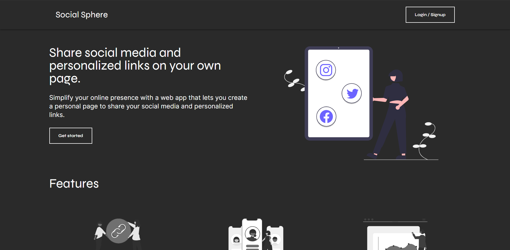
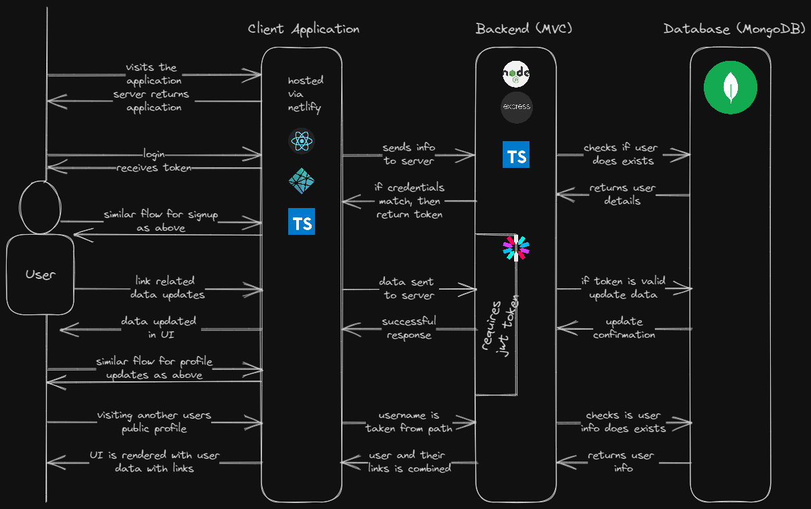

# Social-Sphere

    

Welcome to Social Sphere, a web application that allows users to create their own personal page to share their social media links and other personalized links.

**Table of Contents:**

- [Tech Stack](#-tech-stack)
- [Architecture Explanation](#-architecture-explanation)
- [Quick Start](#-quick-start)
- [Features](#-features)
- [Contributing](#-contributing)
  - [Project Contributors](#-project-contributors)
- [License](#-license)
- [Forking This Repo](#-forking-this-repo)
- [Reference Links](#reference-links)

## 💻 Tech Stack

| Frontend | Backend |
| :---: | :---: |
| React.js | Node.js |
| TypeScript | TypeScript
| Tailwind CSS | Express.js |
| React Router DOM | MongoDB |
| Axios | JsonWebToken
| React Hot Toast | Bcrypt.js |

## 🏗 Architecture Explanation

The application follows a Model-View-Controller (MVC) architecture. The backend handles the data storage and retrieval using MongoDB, while the frontend is responsible for rendering the user interface and making API calls to the backend.

The authentication process is token-based, where JSON Web Tokens (JWT) are generated for authenticated users. The tokens are then checked for requests that require user authentication. The passwords are hashed using bcrypt for secure storage.

## 🚀 Quick Start

To get started with Social Sphere locally, follow these steps:

1. Fork and clone the repository.
2. Install all dependencies for both the frontend and backend by running `npm install` or `yarn` or `pnpm install` in the root directory and the client directory.
3. Create an environment file (`.env`) based on the provided [sample file](./.env.sample) in the root directory.
4. Start the backend server by running npm start in the root directory.
5. Start the frontend development server by running `npm start` in the client directory.
6. Access the application in your browser at <http://localhost:3000> the client application.
7. Access the server at <http://localhost:5000>.

Backend Endpoint Testing and Documentation was done using Postman, check the collection here: [https://documenter.getpostman.com/view/16698636/2s93mATzaQ](https://documenter.getpostman.com/view/16698636/2s93mATzaQ).

## 🌌 Features

- User authentication and authorization
- User-friendly page editor for customization
- Adding and editing social media links and personalized links
- Preview feature for viewing the page before publishing
- Publishing and sharing the page with others
- Responsive design for all screen sizes and devices

## 🎁 Contributing

Contributions to Social Sphere are welcome! If you have any ideas or improvements, feel free to submit a pull request or open an issue. Refer to the [CONTRIBUTING.md](/CONTRIBUTING.md) guide for more information.

### 🤗 Project Contributors

## 📃 License

This project is licensed under the [MPL-v2.0 License](/LICENSE).

### ⚔ Forking This Repo

Many people have contacted us asking if they can use this code for their own websites. The answer to that question is usually "yes", with attribution. There are some cases, such as using this code for a business or something that is greater than a personal project, that we may be less comfortable saying yes to. If in doubt, please don't hesitate to ask us.

We value keeping this project open source, but as you all know, plagiarism is bad. We actively spend a non-negligible amount of effort developing, designing, and trying to perfect this iteration of our project, and we are proud of it! All we ask is to not claim this effort as your own.

So, feel free to fork this repo. If you do, please just give us proper credit by linking back to this repo, [https://github.com/kunalkeshan/Social-Sphere](https://github.com/kunalkeshan/Social-Sphere). Refer to this handy [quora](https://www.quora.com/Is-it-bad-to-copy-other-peoples-code) post if you're not sure what to do. Thanks!

## Reference Links

- [How to Use TypeScript with MongoDB Atlas](https://www.mongodb.com/compatibility/using-typescript-with-mongodb-tutorial)
- [How to set up TypeScript with Node.js and Express](https://blog.logrocket.com/how-to-set-up-node-typescript-express/)
- [MongoDB Node Driver Documentation](https://www.mongodb.com/docs/drivers/node/current/)
